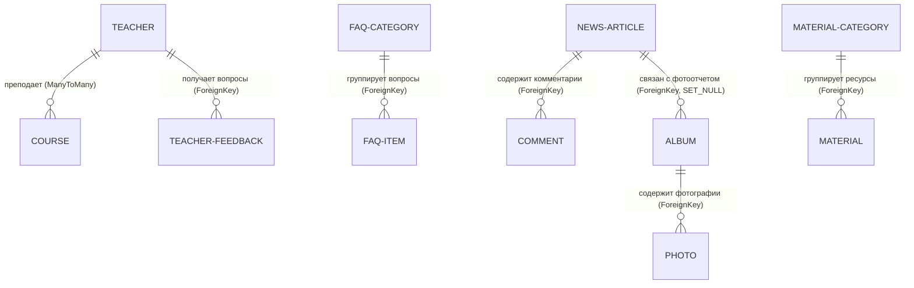

# Архитектура и техническое задание: Информационный сайт ЛФМШ «Квант»

Этот документ содержит полное техническое описание архитектуры, структуры базы данных, распределения задач и плана разработки для информационного веб-сайта летней физико-математической школы «Квант». 

Сайт разрабатывается командой из **12 школьников**, изучающих Django. Каждый раздел представляет собой полноценное изолированное Django-приложение (модуль), разработка которого ведется в отдельной Git-ветке с последующим слиянием.

---

## Важные архитектурные принципы
1. **Отсутствие авторизации**: На сайте нет регистрации, личных кабинетов и ролей. Все разделы и страницы доступны всем пользователям.
2. **Демонстрация Django Forms**: Формы обратной связи, комментариев, отзывов и подачи заявок служат исключительно целям обучения работе с HTML-формами, валидации данных в Django Forms и сохранению записей в базу данных (SQLite).
3. **Работа с медиафайлами**: Поскольку модели используют поля `ImageField` и `FileField`, в проекте настраивается обработка медиафайлов (директория `media/`).
4. **Минимизация конфликтов слияния**: Каждый модуль имеет свою папку с шаблонами (например, `templates/news/`), свои файлы `urls.py`, `models.py`, `views.py` и `forms.py`. Главный проект `quant_site/urls.py` только подключает урлы приложений через `include()`.
5. **Перекрестные связи в БД**: Разделы логически объединены через внешние ключи (ForeignKey, ManyToManyField) там, где это необходимо, создавая целостную информационную систему.

---

## Содержание
1. [Структура сайта и переходы](#1-структура-сайта-и-переходы)
2. [Полная схема базы данных](#2-полная-схема-базы-данных)
3. [Словесное описание ER-диаграммы](#3-словесное-описание-er-диаграммы)
4. [Подробная спецификация разделов (приложений)](#4-подробная-спецификация-разделов-приложений)
5. [Распределение задач и оценка сложности](#5-распределение-задач-и-оценка-сложности)
6. [Структура Django-проекта](#6-структура-django-проекта)
7. [Взаимодействие разделов (Интеграция)](#7-взаимодействие-разделов-интеграция)
8. [План реализации и порядок слияния веток](#8-план-реализации-и-порядок-слияния-веток)

---

## 1. Структура сайта и переходы

Ниже представлена древовидная структура страниц сайта. Все основные разделы доступны из сквозного меню навигации (шапки сайта), определенного в базовом шаблоне `base.html`.

```text
Главная (/)
├── О школе (/about/)
│   └── Форма "Хочу в Квант" (загрузка файла с достижениями, сохранение в БД)
├── Новости (/news/)
│   ├── Список всех новостей
│   ├── Детальная новость (/news/<int:pk>/)
│   │   ├── Вывод комментариев
│   │   └── Форма добавления комментария (отправляет POST-запрос)
│   └── Добавить новость (/news/add/) [Форма Django]
├── Учителя (/teachers/)
│   ├── Список всех преподавателей
│   └── Профиль преподавателя (/teachers/<int:pk>/)
│       ├── Карточка с био, фото и достижениями
│       ├── Список преподаваемых курсов (ссылки)
│       └── Форма "Задать вопрос преподавателю" (отправляет POST-запрос)
├── Курсы (/courses/)
│   ├── Список всех курсов (карточки с иконками)
│   └── Страница курса (/courses/<int:pk>/)
│       ├── Описание программы курса
│       └── Список преподавателей курса (ссылки на их профили)
├── Расписание (/schedule/)
│   └── Режим дня (таблица фиксированного расписания из 15 пунктов)
│       └── Детальная страница пункта (/schedule/<int:pk>/) (описание мероприятия)
├── FAQ (/faq/)
│   └── Аккордеон вопросов, разбитых по категориям
├── Библиотека материалов (/library/)
│   └── Список материалов, разбитых по категориям (скачивание/переход по ссылке)
└── Галерея (/gallery/)
    ├── Список альбомов смен
    └── Детальная страница альбома (/gallery/album/<int:pk>/)
        └── Сетка фотографий с подписями и просмотром в модальном окне
```

### Детализация страниц

1. **Главная страница (`/`)**
   - **Назначение**: Презентационная страница сайта.
   - **Отображаемая информация**: Приветственный баннер школы «Квант», интерактивная плиточная сетка со ссылками на все основные разделы сайта.
   - **Переходы**: На все разделы сайта (`/about/`, `/news/`, `/teachers/`, `/courses/`, `/schedule/`, `/faq/`, `/library/`, `/gallery/`).

2. **Страница «О школе» (`/about/`)**
   - **Назначение**: Рассказать о ЛФМШ «Квант», ее истории, традициях и быте.
   - **Отображаемая информация**: Историческая справка школы, текстовые блоки о преимуществах и особенностях смены. Внизу страницы находится форма "Хочу в Квант" для отправки предварительных заявок с возможностью прикрепить файл достижений.
   - **Модели**: `SchoolApplication` (для сохранения заявок и файлов достижений).
   - **Переходы**: На отправку формы (на этой же странице).

3. **Страница «Все новости» (`/news/`)**
   - **Назначение**: Лента новостей лагеря.
   - **Отображаемая информация**: Сетка карточек новостей (заголовок, дата создания, изображение `img` и первые 200 символов текста новости). Реализован поиск новостей по тексту/заголовку и постраничный вывод (пагинация по 3 штуки).
   - **Модели**: `NewsArticle`.
   - **Переходы**: На страницу детальной новости (`/news/<int:pk>/`), на страницу добавления новости (`/news/add/`).

4. **Страница «Детальная новость» (`/news/<int:pk>/`)**
   - **Назначение**: Чтение полной новости и добавление отзывов/комментариев.
   - **Отображаемая информация**: Полный текст новости, дата публикации, изображение, список комментариев и форма для добавления нового комментария (только текстовое поле `text`).
   - **Модели**: `NewsArticle`, `Comment`.
   - **Переходы**: Назад к списку новостей (`/news/`), на связанные фотоальбомы (если новость привязана к альбому).

5. **Страница «Добавить новость» (`/news/add/`)**
   - **Назначение**: Форма публикации новой новости.
   - **Отображаемая информация**: Django-форма со всеми полями новости (заголовок, текст, загрузка изображения `img`).
   - **Модели**: `NewsArticle`.
   - **Переходы**: После успешной отправки перенаправляет на список новостей (`/news/`).

6. **Страница «Все преподаватели» (`/teachers/`)**
   - **Назначение**: Знакомство с коллективом ЛФМШ «Квант».
   - **Отображаемая информация**: Сетка карточек преподавателей с фотографиями, ФИО и краткой информацией.
   - **Модели**: `Teacher`.
   - **Переходы**: На детальную страницу конкретного преподавателя (`/teachers/<int:pk>/`).

7. **Страница «Профиль преподавателя» (`/teachers/<int:pk>/`)**
   - **Назначение**: Подробный профиль преподавателя.
   - **Отображаемая информация**: ФИО, фотография, биография, достижения, контактная почта. Список курсов, которые ведет данный учитель. Форма обратной связи "Задать вопрос преподавателю" (сохраняет только поле `text` в БД).
   - **Модели**: `Teacher`, `Course` (связь ManyToMany), `TeacherFeedback`.
   - **Переходы**: На детальные страницы курсов преподавателя (`/courses/<int:pk>/`).

8. **Страница «Все курсы» (`/courses/`)**
   - **Назначение**: Каталог учебных направлений школы.
   - **Отображаемая информация**: Список курсов с эмодзи-иконками, кратким описанием и списком преподавателей курса.
   - **Модели**: `Course`, `Teacher`.
   - **Переходы**: На детальную страницу курса (`/courses/<int:pk>/`).

9. **Страница «Детальная страница курса» (`/courses/<int:pk>/`)**
   - **Назначение**: Подробное описание учебной программы курса.
   - **Отображаемая информация**: Полное название, детальная программа обучения и список преподавателей курса со ссылками на их профили.
   - **Модели**: `Course`, `Teacher`.
   - **Переходы**: На профили преподавателей (`/teachers/<int:pk>/`), назад к каталогу курсов.

10. **Страница «Расписание» (`/schedule/`)**
    - **Назначение**: Отображение распорядка дня летней школы.
    - **Отображаемая информация**: Интерактивная таблица, содержащая строго 15 фиксированных пунктов расписания (время начала, время окончания, название события, краткое описание). Каждый пункт таблицы кликабелен.
    - **Модели**: `ScheduleItem`.
    - **Переходы**: На детальную страницу пункта расписания (`/schedule/<int:pk>/`).

11. **Страница «Детальное событие расписания» (`/schedule/<int:pk>/`)**
    - **Назначение**: Подробная карточка режимного мероприятия.
    - **Отображаемая информация**: Время начала и окончания события, название, краткое описание и детальное описание события (правила, рекомендации).
    - **Модели**: `ScheduleItem`.
    - **Переходы**: Назад к списку расписания.

12. **Страница «Часто задаваемые вопросы» (`/faq/`)**
    - **Назначение**: База вопросов и ответов для родителей и учеников.
    - **Отображаемая информация**: Рубрикатор категорий вопросов и интерактивный аккордеон "Вопрос-Ответ".
    - **Модели**: `FAQCategory`, `FAQItem`.
    - **Переходы**: Раскрытие аккордеона на месте.

13. **Страница «Библиотека материалов» (`/library/`)**
    - **Назначение**: Сборник полезных материалов для обучения.
    - **Отображаемая информация**: Список материалов, структурированный по категориям (Книги, Презентации, Домашние задания). Рядом с файлами выводится кнопка «Скачать» (для скачивания из папки static), рядом со ссылками — кнопка «Перейти».
    - **Модели**: `MaterialCategory`, `Material`.
    - **Переходы**: Внешние ссылки, скачивание файлов.

14. **Страница «Галерея» (`/gallery/`)**
    - **Назначение**: Каталог фотоальбомов лагеря.
    - **Отображаемая информация**: Сетка папок-альбомов с названиями, описанием, датой создания и обложкой.
    - **Модели**: `Album`.
    - **Переходы**: На детальную страницу конкретного альбома (`/gallery/album/<int:pk>/`).

15. **Страница «Фотоальбом» (`/gallery/album/<int:pk>/`)**
    - **Назначение**: Просмотр фотографий конкретного альбома.
    - **Отображаемая информация**: Название и описание альбома, дата создания, ссылка на связанную новость (если есть), сетка фотографий с подписями. При клике на фото открывается модальное окно просмотра во весь экран.
    - **Модели**: `Album`, `Photo`.
    - **Переходы**: На страницу связанной новости (`/news/<int:news_pk>/`), назад в список альбомов.

---

## 2. Полная схема базы данных

Все модели Django описываются в своих приложениях, но связываются внешними ключами. Ниже приведена полная спецификация полей для каждой модели.

### Приложение `main` (О школе)

#### 1. Модель `SchoolApplication` (Заявки "Хочу в Квант")
* **Назначение**: Сбор заявок от будущих учеников через форму на странице «О школе».
* **Поля**:
  * `id` (`AutoField`, primary_key=True)
  * `parent_name` (`CharField`, max_length=100, null=False, blank=False) — ФИО родителя.
  * `student_name` (`CharField`, max_length=100, null=False, blank=False) — ФИО ребенка.
  * `student_age` (`IntegerField`, null=False, blank=False) — возраст ребенка.
  * `phone` (`CharField`, max_length=20, null=False, blank=False) — телефон для связи.
  * `email` (`EmailField`, null=False, blank=False) — электронная почта.
  * `created_at` (`DateTimeField`, auto_now_add=True) — дата подачи заявки.
  * `achivments` (`FileField`, null=False, blank=False, upload_to="applications/") — файл с достижениями ученика.

---

### Приложение `news` (Новости)

#### 2. Модель `NewsArticle` (Новость)
* **Назначение**: Хранение публикаций новостной ленты.
* **Поля**:
  * `id` (`AutoField`, primary_key=True)
  * `title` (`CharField`, max_length=200, null=False, blank=False) — заголовок новости.
  * `text` (`TextField`, null=False, blank=False) — содержание новости.
  * `img` (`ImageField`, null=False, blank=False, default="img/default.jpg", upload_to="img/") — файл изображения новости.
  * `created_at` (`DateTimeField`, auto_now_add=True) — дата и время создания.

#### 3. Модель `Comment` (Комментарий)
* **Назначение**: Комментарии к новостям.
* **Поля**:
  * `id` (`AutoField`, primary_key=True)
  * `article` (`ForeignKey` к `NewsArticle`, on_delete=models.CASCADE, related_name="comments") — связь с новостью.
  * `text` (`TextField`, null=False, blank=False) — текст комментария.
  * `created_at` (`DateTimeField`, auto_now_add=True) — дата публикации комментария.

---

### Приложение `teachers` (Преподаватели)

#### 4. Модель `Teacher` (Преподаватель)
* **Назначение**: Карточка сотрудника/преподавателя школы.
* **Поля**:
  * `id` (`AutoField`, primary_key=True)
  * `first_name` (`CharField`, max_length=100, null=False, blank=False) — имя.
  * `last_name` (`CharField`, max_length=100, null=False, blank=False) — фамилия.
  * `patronymic` (`CharField`, max_length=100, null=True, blank=True) — отчество (необязательное).
  * `photo` (`ImageField`, null=False, blank=False, default="media/img/teachers/teacher_placeholder.png", upload_to="teachers/") — файл фото преподавателя.
  * `short_info` (`CharField`, max_length=255, null=False, blank=False) — должность или предмет.
  * `bio` (`TextField`, null=False, blank=False) — автобиография.
  * `achievements` (`TextField`, null=True, blank=True) — награды, регалии (необязательное).
  * `contact_email` (`EmailField`, null=True, blank=True) — контактная почта (необязательное).

#### 5. Модель `TeacherFeedback` (Вопросы преподавателю)
* **Назначение**: Сохранение вопросов/отзывов преподавателю.
* **Поля**:
  * `id` (`AutoField`, primary_key=True)
  * `teacher` (`ForeignKey` к `Teacher`, on_delete=models.CASCADE, related_name="feedbacks") — преподаватель, которому задан вопрос.
  * `text` (`TextField`, null=False, blank=False) — текст вопроса.
  * `created_at` (`DateTimeField`, auto_now_add=True) — дата отправки.

---

### Приложение `courses` (Курсы)

#### 6. Модель `Course` (Учебный курс)
* **Назначение**: Хранение учебных программ.
* **Поля**:
  * `id` (`AutoField`, primary_key=True)
  * `title` (`CharField`, max_length=150, null=False, blank=False) — название курса.
  * `short_description` (`CharField`, max_length=255, null=False, blank=False) — краткое описание для превью-карточки.
  * `description` (`TextField`, null=False, blank=False) — полное описание курса.
  * `icon` (`CharField`, max_length=50, null=False, blank=False, default="📚") — эмодзи-иконка.
  * `teachers` (`ManyToManyField` к `Teacher`, related_name="courses") — преподаватели курса (связь Many-to-Many).

---

### Приложение `schedule` (Расписание)

#### 7. Модель `ScheduleItem` (Пункт расписания)
* **Назначение**: Хранение элементов строго зафиксированного режима дня школы «Квант».
* **Поля**:
  * `id` (`AutoField`, primary_key=True)
  * `order` (`IntegerField`, unique=True, null=False, blank=False) — порядковый номер (1-15) для строгой сортировки в таблице.
  * `time_start` (`TimeField`, null=False, blank=False) — время начала.
  * `time_end` (`TimeField`, null=True, blank=True) — время окончания.
  * `event_name` (`CharField`, max_length=150, null=False, blank=False) — название события.
  * `short_description` (`CharField`, max_length=255, null=False, blank=False) — краткое описание.
  * `detailed_description` (`TextField`, null=False, blank=False) — развернутые подробности события.

---

### Приложение `faq` (Часто задаваемые вопросы)

#### 8. Модель `FAQCategory` (Категория вопросов)
* **Назначение**: Группировка вопросов по темам.
* **Поля**:
  * `id` (`AutoField`, primary_key=True)
  * `name` (`CharField`, max_length=100, null=False, blank=False) — название категории.
  * `order` (`IntegerField`, null=False, blank=False, default=0) — порядок сортировки.

#### 9. Модель `FAQItem` (Вопрос-Ответ)
* **Назначение**: База вопросов и ответов.
* **Поля**:
  * `id` (`AutoField`, primary_key=True)
  * `category` (`ForeignKey` к `FAQCategory`, on_delete=models.CASCADE, related_name="items") — связь с категорией.
  * `question` (`CharField`, max_length=255, null=False, blank=False) — формулировка вопроса.
  * `answer` (`TextField`, null=False, blank=False) — подробный ответ.

---

### Приложение `library` (Библиотека материалов)

#### 10. Модель `MaterialCategory` (Категория материалов)
* **Назначение**: Рубрикация материалов.
* **Поля**:
  * `id` (`AutoField`, primary_key=True)
  * `name` (`CharField`, max_length=100, null=False, blank=False) — название.

#### 11. Модель `Material` (Учебный материал)
* **Назначение**: Хранение полезных материалов (ссылок и файлов).
* **Поля**:
  * `id` (`AutoField`, primary_key=True)
  * `title` (`CharField`, max_length=150, null=False, blank=False) — название.
  * `description` (`TextField`, null=True, blank=True) — краткое описание.
  * `material_type` (`CharField`, max_length=20, null=False, blank=False, choices=[('link', 'Ссылка'), ('file', 'Файл')], default='link') — переключатель типа (внешняя ссылка или локальный файл).
  * `link` (`CharField`, null=True, blank=True) — URL-адрес (если это ссылка).
  * `file_name` (`CharField`, max_length=150, null=True, blank=True) — имя файла в папке `static/files/` (если это файл).
  * `category` (`ForeignKey` к `MaterialCategory`, on_delete=models.CASCADE, related_name="materials") — категория материала.

---

### Приложение `gallery` (Галерея)

#### 12. Модель `Album` (Фотоальбом)
* **Назначение**: Группировка фотографий по событиям.
* **Поля**:
  * `id` (`AutoField`, primary_key=True)
  * `title` (`CharField`, max_length=150, null=False, blank=False) — название альбома.
  * `description` (`TextField`, null=True, blank=True) — описание.
  * `cover_image` (`ImageField`, max_length=150, null=False, blank=False, default="gallery/album_placeholder.jpg", upload_to="gallery/") — файл обложки.
  * `created_at` (`DateField`, auto_now_add=True) — дата съемки/создания альбома.
  * `related_news` (`ForeignKey` к `NewsArticle`, on_delete=models.SET_NULL, null=True, blank=True, related_name="albums") — связь с конкретной новостью о событии (необязательное).

#### 13. Модель `Photo` (Фотография)
* **Назначение**: Изображения внутри альбомов.
* **Поля**:
  * `id` (`AutoField`, primary_key=True)
  * `album` (`ForeignKey` к `Album`, on_delete=models.CASCADE, related_name="photos") — фотоальбом.
  * `img` (`ImageField`, max_length=150, null=False, blank=False, upload_to="gallery/") — файл фотографии.
  * `caption` (`CharField`, max_length=200, null=True, blank=True) — подпись к фотографии (необязательное).
  * `uploaded_at` (`DateTimeField`, auto_now_add=True) — дата добавления.

---

## 3. Словесное описание ER-диаграммы

Для визуализации архитектуры базы данных используется следующая схема отношений сущностей:



### Как связаны модели проекта (Связи сущностей)

1. **Учебный процесс (`Teacher` ↔ `Course`)**: 
   * Связь **ManyToMany** (многие ко многим). Один курс могут вести несколько учителей, и один учитель может преподавать на нескольких курсах. В Django это реализуется полем `teachers` в модели `Course`.
   
2. **Интерактивные комментарии (`NewsArticle` ➡️ `Comment`)**:
   * Связь **ForeignKey**. Комментарий `Comment` привязан к одной конкретной новости `NewsArticle` (`on_delete=models.CASCADE`). Каждая новость может иметь неограниченное число комментариев. При удалении новости все комментарии удаляются.
   
3. **Связь фотоотчетов с новостями (`NewsArticle` ⬅️ `Album`)**:
   * Связь **ForeignKey** с параметром `on_delete=models.SET_NULL, null=True, blank=True`. Фотоальбом может быть привязан к новости, освещающей это событие. Если новость будет удалена, альбом сохранится, но связь очистится.

4. **Вопросы преподавателю (`Teacher` ➡️ `TeacherFeedback`)**:
   * Связь **ForeignKey**. Каждый отзыв/вопрос относится к одному конкретному преподавателю. При удалении преподавателя все его отзывы удаляются.

5. **Группировка FAQ (`FAQCategory` ➡️ `FAQItem`)**:
   * Связь **ForeignKey**. Вопросы группируются по категориям (например, категория "Быт" содержит вопросы о питании, стирке и т.д.). При удалении категории удаляются все входящие в нее вопросы.

6. **Группировка материалов (`MaterialCategory` ➡️ `Material`)**:
   * Связь **ForeignKey**. Учебные материалы классифицируются по категориям. При удалении категории удаляются все входящие в нее материалы.

7. **Связь фотографий с альбомами (`Album` ➡️ `Photo`)**:
   * Связь **ForeignKey**. Каждая фотография принадлежит ровно одному альбому. При удалении альбома удаляются все его фотографии.

---

## 4. Подробная спецификация разделов (приложений)

Ниже детально расписана функциональность и состав каждого из 8 приложений Django.

### 1. Новости (`news`)
* **Разработчики**: 2 школьника.
* **Назначение**: Ведение новостной ленты лагеря, получение обратной связи.
* **Представления (Views)**:
  * `NewsListView` (функция `news_list`): рендеринг списка новостей с поддержкой GET-параметра `q` (поиск по тексту и заголовкам) и пагинации (по 3 новости на страницу).
  * `NewsDetailView` (функция `news_detail`): отображение детальной новости. Обрабатывает POST-запрос формы `CommentForm` для отправки комментария. При успешной валидации объект сохраняется в БД.
  * `NewsCreateView` (функция `news_add`): форма добавления новости через Django Forms.
* **Формы (`forms.py`)**:
  * `CommentForm` (поля: `text`).
  * `NewsArticleForm` (поля: `title`, `text`, `img`).
* **Шаблоны (`templates/news/`)**:
  * `news_list.html` (сетка новостей, поисковая строка, блок пагинации).
  * `news_detail.html` (текст новости, комментарии, форма добавления коммента).
  * `news_add.html` (форма создания записи).
* **Маршруты (`urls.py`)**:
  * `""` ➡️ `views.news_list` (имя: `news_list`)
  * `"<int:pk>/"` ➡️ `views.news_detail` (имя: `news_detail`)
  * `"add/"` ➡️ `views.news_add` (имя: `news_add`)

### 2. Преподаватели (`teachers`)
* **Разработчики**: 2 школьника.
* **Назначение**: Презентация преподавательского и вожатского состава.
* **Представления (Views)**:
  * `TeacherListView` (`teacher_list`): отображение списка карточек учителей.
  * `TeacherDetailView` (`teacher_detail`): детальная страница преподавателя, список его курсов (через ManyToMany). Обрабатывает форму `TeacherFeedbackForm` (вопросы преподавателю).
* **Формы (`forms.py`)**:
  * `TeacherFeedbackForm` (поля: `text`).
* **Шаблоны (`templates/teachers/`)**:
  * `teacher_list.html` (сетка преподавателей с фото и краткой инфой).
  * `teacher_detail.html` (полное био, достижения, список курсов со ссылками, форма отправки вопроса).
* **Маршруты (`urls.py`)**:
  * `""` ➡️ `views.teacher_list` (имя: `teacher_list`)
  * `"<int:pk>/"` ➡️ `views.teacher_detail` (имя: `teacher_detail`)

### 3. Курсы (`courses`)
* **Разработчики**: 2 школьника.
* **Назначение**: Презентация учебной программы.
* **Представления (Views)**:
  * `CourseListView` (`course_list`): список курсов школы в виде карточек.
  * `CourseDetailView` (`course_detail`): страница конкретного курса (описание, преподаватели).
* **Формы (`forms.py`)**:
  * Нет форм (соответствующая модель `CourseApplication` и функционал удалены).
* **Шаблоны (`templates/courses/`)**:
  * `course_list.html` (каталог курсов).
  * `course_detail.html` (описание программы, преподаватели).
* **Маршруты (`urls.py`)**:
  * `""` ➡️ `views.course_list` (имя: `course_list`)
  * `"<int:pk>/"` ➡️ `views.course_detail` (имя: `course_detail`)

### 4. О школе (`main`)
* **Разработчик**: 1 школьник.
* **Назначение**: Создание общего каркаса сайта, главной страницы и раздела истории.
* **Представления (Views)**:
  * `IndexView` (`index`): рендеринг главной страницы.
  * `AboutView` (`about`): страница «О школе». Обрабатывает POST-запросы формы `SchoolApplicationForm` с файлом достижений (`request.FILES`).
* **Формы (`forms.py`)**:
  * `SchoolApplicationForm` (поля: `parent_name`, `student_name`, `student_age`, `phone`, `email`, `achivments`).
* **Шаблоны (`templates/main/`)**:
  * `base.html` (главный файл: шапка с навигацией, блок ``, подвал с контактами).
  * `index.html` (главная страница-плитка, баннер-приветствие).
  * `about.html` (история школы, форма заявки).
* **Маршруты (`urls.py`)**:
  * `""` ➡️ `views.index` (имя: `index`)
  * `"about/"` ➡️ `views.about` (имя: `about`)

### 5. Расписание (`schedule`)
* **Разработчики**: 2 школьника.
* **Назначение**: Отображение распорядка дня школы.
* **Отображение расписания**:
  * Таблица строго соответствует фиксированному распорядку дня из 15 пунктов (от Подъёма до Отбоя). Изменение времени, порядка или названий не допускается.
* **Представления (Views)**:
  * `ScheduleListView` (`schedule_view`): рендеринг таблицы режима дня, отсортированной по полю `order`.
  * `ScheduleDetailView` (`schedule_detail`): детальное описание события (краткое и подробное описание, место проведения).
* **Формы (`forms.py`)**:
  * Нет форм (модели предложений мероприятий удалены).
* **Шаблоны (`templates/schedule/`)**:
  * `schedule_list.html` (таблица расписания с колонками Время и Событие).
  * `schedule_detail.html` (детали события: время, место, краткое и подробное описание).
* **Маршруты (`urls.py`)**:
  * `""` ➡️ `views.schedule_view` (имя: `schedule_view`)
  * `"<int:pk>/"` ➡️ `views.schedule_detail` (имя: `schedule_detail`)

### 6. Часто задаваемые вопросы (`faq`)
* **Разработчик**: 1 школьник.
* **Назначение**: Быстрые ответы на частые вопросы.
* **Представления (Views)**:
  * `FAQView` (`faq_view`): вытягивает все категории `FAQCategory` с предзагруженными вопросами (`prefetch_related('items')`) и рендерит страницу с аккордеоном.
* **Формы (`forms.py`)**:
  * Нет форм (модель пользовательских вопросов удалена).
* **Шаблоны (`templates/faq/`)**:
  * `faq_list.html` (аккордеон вопросов по категориям на чистом CSS/JS).
* **Маршруты (`urls.py`)**:
  * `"faq/"` ➡️ `views.faq_view` (имя: `faq_view`)

### 7. Библиотека материалов (`library`)
* **Разработчик**: 1 школьник.
* **Назначение**: Публикация полезных файлов и ссылок для учебы.
* **Представления (Views)**:
  * `LibraryView` (`library_view`): вывод материалов библиотеки, сгруппированных по категориям.
* **Формы (`forms.py`)**:
  * Нет форм.
* **Шаблоны (`templates/library/`)**:
  * `library_list.html` (список материалов по категориям со ссылками на скачивание или переход).
* **Маршруты (`urls.py`)**:
  * `"library/"` ➡️ `views.library_view` (имя: `library_view`)

### 8. Галерея (`gallery`)
* **Разработчик**: 1 школьник.
* **Назначение**: Раздел фотоальбомов.
* **Представления (Views)**:
  * `AlbumListView` (`album_list`): список фотоальбомов в виде плитки.
  * `AlbumDetailView` (`album_detail`): сетка фотографий альбома.
* **Формы (`forms.py`)**:
  * Нет форм.
* **Шаблоны (`templates/gallery/`)**:
  * `album_list.html` (список альбомов с датами и обложками).
  * `album_detail.html` (сетка миниатюр с Lightbox-эффектом для полноэкранного просмотра при клике).
* **Маршруты (`urls.py`)**:
  * `"gallery/"` ➡️ `views.album_list` (имя: `album_list`)
  * `"gallery/album/<int:pk>/"` ➡️ `views.album_detail` (имя: `album_detail`)

---

## 5. Распределение задач и оценка сложности

Работы распределены между 12 школьниками сбалансированно. Сложность оценивается по шкале от 1 до 5 звезд.

| Школьник          | Раздел (Приложение) | Что реализует (конкретные задачи) | Оценка сложности |
|:------------------| :--- | :--- | :---: |
| **Артем и Тимур** | `news` (Новости) | Создание моделей `NewsArticle` и `Comment`. Список новостей с пагинацией и поиском. Детальная страница с выводом комментариев. Форма `CommentForm` (текст). Форма `NewsArticleForm` для публикации новостей (с загрузкой картинок). | ⭐⭐⭐⭐ (4/5) |
| **Гадель и Дима** | `teachers` (Преподаватели) | Создание моделей `Teacher` и `TeacherFeedback`. Список учителей. Детальная страница преподавателя с био и достижениями. Вывод списка курсов преподавателя. Форма отправки вопросов учителю (`TeacherFeedbackForm`). | ⭐⭐⭐ (3/5) |
| **Максим**        | `courses` (Курсы) | Создание модели `Course`. Сетка курсов с иконками. Страница курса со списком преподавателей (ссылки). Связь Many-to-Many с моделью `Teacher`. | ⭐⭐ (2/5) |
| **Карим**         | `main` (Главная и О школе) | Создание `base.html` (общие стили, меню, футер). Создание модели `SchoolApplication`. Верстка главной страницы и страницы «О школе» с формой `SchoolApplicationForm` (с загрузкой файла `achivments`). | ⭐⭐⭐ (3/5) |
| **Ясмина**        | `schedule` (Расписание) | Создание модели `ScheduleItem`. Написание миграции данных для автозаполнения 15 пунктов режима дня. Таблица расписания. Детальные страницы событий. | ⭐⭐⭐ (3/5) |
| **Салават**       | `faq` (FAQ) | Создание моделей `FAQCategory` и `FAQItem`. Группировка вопросов по категориям в представлении, верстка интерактивного аккордеона. | ⭐⭐ (2/5) |
| **Рамиль**        | `library` (Библиотека) | Создание моделей `MaterialCategory` и `Material`. Список ресурсов с разделением на ссылки и файлы в шаблоне. | ⭐⭐ (2/5) |
| **Тагир и Айдар** | `gallery` (Галерея) | Создание моделей `Album` и `Photo`. Список альбомов, детальная страница с сеткой фотографий. Подключение плагина просмотра картинок (Lightbox) в шаблоне. | ⭐⭐⭐ (3/5) |

---

## 6. Структура Django-проекта

Проект структурирован так, чтобы код каждого приложения лежал в своей директории. Шаблоны также разделены по подпапкам.

```text
kvant_django_site/                  # Корень репозитория Git
├── manage.py                       # Скрипт управления Django
├── requirements.txt                # Зависимости (django>=5.0, pillow)
├── db.sqlite3                      # База данных SQLite
├── media/                          # Директория загружаемых файлов (пользовательские медиа)
│   ├── applications/               # Загружаемые файлы достижений (achivments)
│   ├── img/                        # Загружаемые изображения новостей (img)
│   ├── teachers/                   # Загружаемые фото преподавателей (photo)
│   └── gallery/                    # Загружаемые обложки и фото альбомов (cover_image, img)
├── static/                         # Общие статические файлы
│   ├── css/
│   │   └── style.css               # Главная таблица стилей всего сайта
│   ├── img/
│   │   └── logo.png                # Логотип школы
│   └── files/                      # Учебные файлы библиотеки для скачивания (static)
├── templates/                      # Глобальная папка шаблонов
│   ├── base.html                   # Общий шаблон (навигация, футер, стили)
│   ├── main/
│   │   ├── index.html              # Главная страница
│   │   └── about.html              # О школе
│   ├── news/
│   │   ├── news_list.html
│   │   ├── news_detail.html
│   │   └── news_add.html
│   ├── teachers/
│   │   ├── teacher_list.html
│   │   └── teacher_detail.html
│   ├── courses/
│   │   ├── course_list.html
│   │   └── course_detail.html
│   ├── schedule/
│   │   ├── schedule_list.html
│   │   └── schedule_detail.html
│   ├── faq/
│   │   └── faq_list.html
│   ├── library/
│   │   └── library_list.html
│   └── gallery/
│       ├── album_list.html
│       └── album_detail.html
├── quant_site/                     # Главное конфигурационное приложение
│   ├── __init__.py
│   ├── settings.py                 # Подключение приложений, MEDIA_URL, MEDIA_ROOT
│   ├── urls.py                     # Подключение urls.py всех приложений + static(settings.MEDIA_URL)
│   └── wsgi.py
├── main/                           # Приложение main (О школе)
│   ├── migrations/
│   ├── models.py                   # SchoolApplication
│   ├── views.py                    # views: index, about
│   ├── forms.py                    # SchoolApplicationForm
│   └── urls.py                     # Маршруты "" и "about/"
├── news/                           # Приложение news (Новости)
│   ├── migrations/
│   ├── models.py                   # NewsArticle, Comment
│   ├── views.py                    # views: news_list, news_detail, news_add
│   ├── forms.py                    # CommentForm, NewsArticleForm
│   └── urls.py                     # Маршруты "news/", "news/<int:pk>/", "news/add/"
├── teachers/                       # Приложение teachers (Преподаватели)
│   ├── migrations/
│   ├── models.py                   # Teacher, TeacherFeedback
│   ├── views.py                    # views: teacher_list, teacher_detail
│   ├── forms.py                    # TeacherFeedbackForm
│   └── urls.py                     # Маршруты "teachers/", "teachers/<int:pk>/"
├── courses/                        # Приложение courses (Курсы)
│   ├── migrations/
│   ├── models.py                   # Course
│   ├── views.py                    # views: course_list, course_detail
│   └── urls.py                     # Маршруты "courses/", "courses/<int:pk>/"
├── schedule/                       # Приложение schedule (Расписание)
│   ├── migrations/
│   ├── models.py                   # ScheduleItem
│   ├── views.py                    # views: schedule_view, schedule_detail
│   └── urls.py                     # Маршруты "schedule/", "schedule/<int:pk>/"
├── faq/                            # Приложение faq (Часто задаваемые вопросы)
│   ├── migrations/
│   ├── models.py                   # FAQCategory, FAQItem
│   ├── views.py                    # views: faq_view
│   └── urls.py                     # Маршруты "faq/"
├── library/                        # Приложение library (Библиотека)
│   ├── migrations/
│   ├── models.py                   # MaterialCategory, Material
│   ├── views.py                    # views: library_view
│   └── urls.py                     # Маршруты "library/"
└── gallery/                        # Приложение gallery (Галерея)
    ├── migrations/
    ├── models.py                   # Album, Photo
    ├── views.py                    # views: album_list, album_detail
    └── urls.py                     # Маршруты "gallery/", "gallery/album/<int:pk>/"
```

---

## 7. Взаимодействие разделов (Интеграция)

Сайт представляет собой единую экосистему благодаря следующим связям:

1. **Интеграция Учителей и Курсов**:
   * На детальной странице курса (`courses/course_detail.html`) с помощью цикла `` выводятся все преподаватели данного направления. Имя каждого учителя является ссылкой на его профиль: ``.
   * Соответственно, в профиле учителя (`teachers/teacher_detail.html`) с помощью `` выводятся курсы, которые он ведет, со ссылками на страницы курсов.

2. **Интеграция Новости и Фотогалереи**:
   * Приложение `gallery` содержит модель `Album`, которая имеет необязательное поле `related_news` (внешний ключ на `news.NewsArticle`).
   * На детальной странице новости (`news/news_detail.html`) проверяется наличие связанных альбомов (``). Если альбом привязан, выводится кнопка-ссылка "Смотреть фотоотчет" на страницу альбома. 
   * На странице альбома выводится обратная ссылка на новость: "Читать статью о событии".

